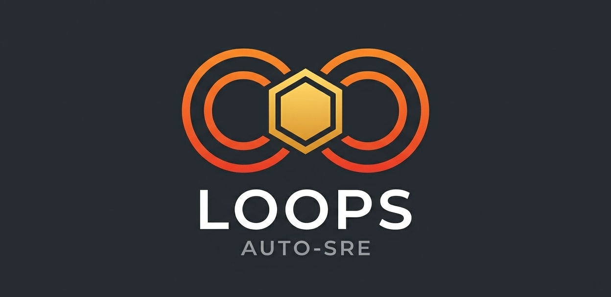

<p align="center">
  
</p>

<p align="center">
  <strong>AI-Powered Auto-SRE Platform</strong><br/>
  Intelligent infrastructure operations with Claude AI agents, multi-cloud visibility, and automated incident response.
</p>

---

## What is Loops?

Loops is a full-stack infrastructure operations platform that puts an AI agent at the center of your SRE workflow. Instead of jumping between dashboards, terminals, and runbooks, your team interacts with a Claude-powered agent that has real-time access to your clusters, metrics, logs, and deployment pipelines.

It's not a chatbot wrapper — the agent runs real tools (kubectl, AWS CLI, PromQL, LogQL) against your live infrastructure, streams its reasoning process, and takes action with human-in-the-loop approval.

## Core Capabilities

### AI Agent with Full Infrastructure Context

The built-in Claude agent isn't a generic LLM chat. On every session, it receives a dynamically generated context file containing:

- All cloud accounts, clusters, and their endpoints
- Observability stack URLs (Grafana/Mimir/Loki/Tempo or CloudWatch/X-Ray)
- Glossary terms specific to your organization
- Jira integration details for ticket creation

The agent uses MCP (Model Context Protocol) servers and installable Skills to extend its capabilities — security scanning, billing analysis, browser automation, and any custom tooling your team builds.

```
User: "Production API latency spiked 3x in the last 10 minutes"

Agent: [Queries Mimir for p99 latency] → [Checks Loki for error logs]
     → [Inspects rollout status] → [Correlates with recent deployment]
     → [Streams RCA report with evidence]
```

### Deployment Management (Argo Rollouts)

Native integration with Argo Rollouts for progressive delivery:

- **Canary** — Step-by-step traffic shifting with automated analysis
- **Blue-Green** — Zero-downtime cutover with instant rollback
- **Promote / Rollback** — One-click operations from the UI or via AI agent
- **Live Topology** — Visual service graph (Ingress → Service → Rollout) with real-time status

### Security Scanning

Integrated AWS Service Screener (global + China regions) for continuous security posture assessment:

- Multi-region, multi-service scanning
- Findings by severity (critical/high/medium/low) and category (security, cost, reliability, performance)
- Exportable reports (XLSX, CSV, JSON, PDF)
- AI-assisted remediation recommendations

### Multi-Cloud Observability

Unified telemetry routing across providers:

| Signal | EKS Workloads | AWS Services |
|--------|--------------|--------------|
| Metrics | Mimir (PromQL) | CloudWatch |
| Logs | Loki (LogQL) | CloudWatch Logs |
| Traces | Tempo | X-Ray |

Plus integrations with **Grafana Cloud**, **Datadog**, and **Dynatrace** for alert ingestion and dashboard linking.

### Issue Lifecycle & RCA

- Alerts from any source (Grafana, Datadog, Dynatrace webhooks) are normalized into a unified issue tracker
- Smart deduplication by fingerprint
- AI-powered Root Cause Analysis with streaming output — the agent queries metrics, logs, and traces in real-time and produces a structured RCA
- Jira integration for auto-creating tickets on deployment events

## Platform Features

| Feature | Description |
|---------|-------------|
| **Multi-Tenancy** | Full tenant isolation — accounts, users, skills, MCP servers, providers all scoped per tenant |
| **RBAC** | Super Admin / Tenant Admin / User roles with per-account read/write grants |
| **Skills System** | Git-based skill discovery and installation with per-user symlink isolation |
| **MCP Servers** | stdio / SSE / HTTP transports, per-tool enable/disable, auto-authorization for built-in tools |
| **LLM Providers** | Configure Claude (direct), Bedrock, or Gateway endpoints per tenant |
| **Knowledge Base** | Markdown docs with Mermaid diagram rendering, shared across the team |
| **Glossary** | Organization-specific terminology, auto-injected into agent context |
| **Notification Channels** | Slack, Feishu (Lark), Microsoft Teams, Jira |
| **OAuth Login** | Microsoft Azure AD + AWS Cognito, alongside local username/password |
| **Approval Workflows** | Change approval gates for sensitive operations |
| **Scheduled Jobs** | Recurring tasks with execution history |
| **i18n** | English + Chinese |
| **Dark/Light Theme** | System-aware with manual toggle |

## Tech Stack

| Layer | Technology |
|-------|-----------|
| Frontend | Nuxt 3, Vue 3, TypeScript, shadcn-vue, Tailwind CSS |
| Backend | Rust, Axum, SQLx, Tokio |
| Database | PostgreSQL (Aurora in production) |
| AI | Claude Code CLI, MCP, streaming SSE |
| Infrastructure | Terraform, EKS, Karpenter (Graviton), Aurora, WAF |
| Secrets | AWS Secrets Manager + External Secrets Operator |
| Deployment | Argo Rollouts, Helm, ALB Ingress Controller |

## Project Structure

```
loops/
├── frontend/          # Nuxt 3 SSR application
├── backend/           # Rust API server
├── iac/               # Terraform modules (VPC, EKS, RDS, WAF, Cognito, EFS)
├── k8s/               # Kubernetes manifests + Helm infrastructure
├── scripts/           # Deploy, build, dev, and utility scripts
├── docs/              # Deployment guide, local dev guide
└── assets/            # Logo and brand assets
```

## Quick Start

```bash
# Local development (PostgreSQL + Rust backend + Nuxt frontend)
./scripts/local-dev.sh

# Open http://localhost:3003 — login: admin / admin123
```

See [Local Development Guide](docs/local-development.md) for detailed setup.

## Deployment

One-command deployment to AWS EKS:

```bash
./scripts/deploy-all.sh
```

See [Deployment Guide](docs/deployment.md) for step-by-step instructions and infrastructure details.

## License

MIT
