# 把 Claude Code 当 SRE 用：4 个真实场景展示 AI 如何接管基础设施运维

> **系列第二篇**。第一篇 [《为什么我们选 Claude Code CLI 当 SRE Runtime》](./claude-code-as-runtime-philosophy.md) 解释了架构决策的底层思考——为什么是 "runtime" 而不是 "API"。这一篇不谈理论，只用真实截图展示它能干什么：4 个运维场景——自动 RCA、Canary 发布、自然语言运维、安全扫描。

---

## 为什么不是又一个 ChatOps？

市面上不缺 "给 LLM 塞一个 kubectl wrapper" 的项目。Loops 的区别在于：**Claude Code CLI 本身就是 runtime**——它不是调一个 API 拿回答案，而是作为一个 child process 常驻，拥有完整的工具调用能力、多轮上下文、和流式输出。

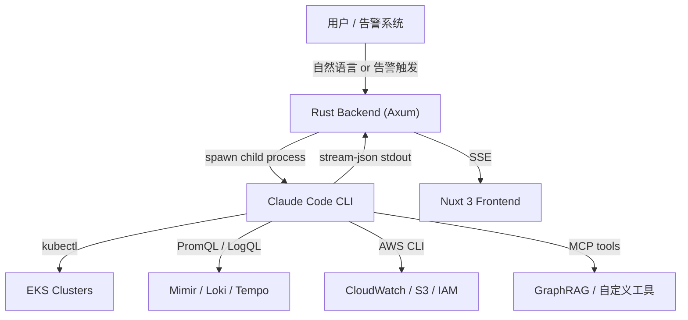

关键点：**Backend 不直接调用 AWS API 或 kubectl**。它把决策权交给 Claude Code agent，agent 根据注入的集群信息和用户问题，自主决定调用哪些工具、以什么顺序调用。每一次工具调用的输入输出都通过 SSE 实时推送到前端——完全透明，不是黑盒。

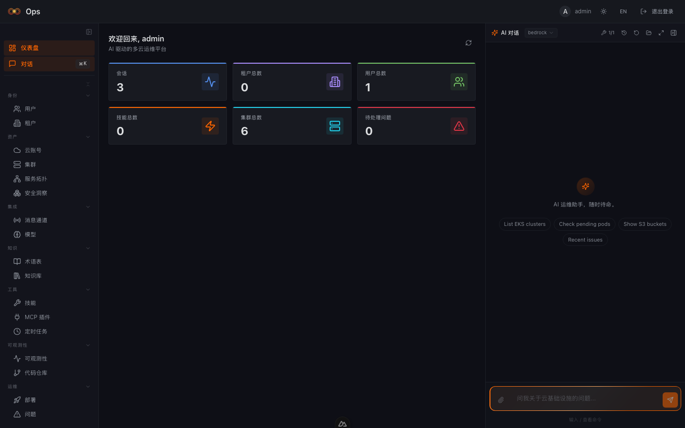

Dashboard 右侧是常驻的 AI Chat 面板，支持自然语言查询、图片附件、多 session 管理。下方是自动发现的 6 个 EKS 集群（AWS Global + 东南亚区域）和 多云账号管理（含 AWS 中国区）：

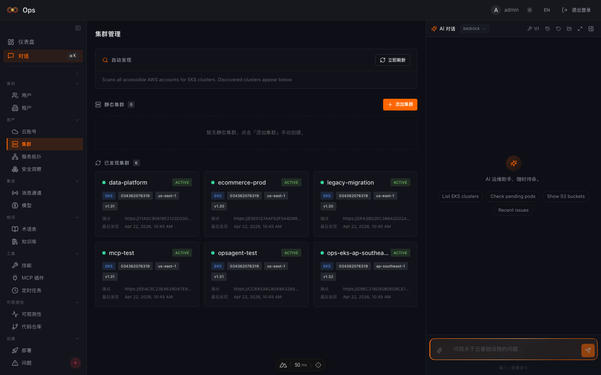

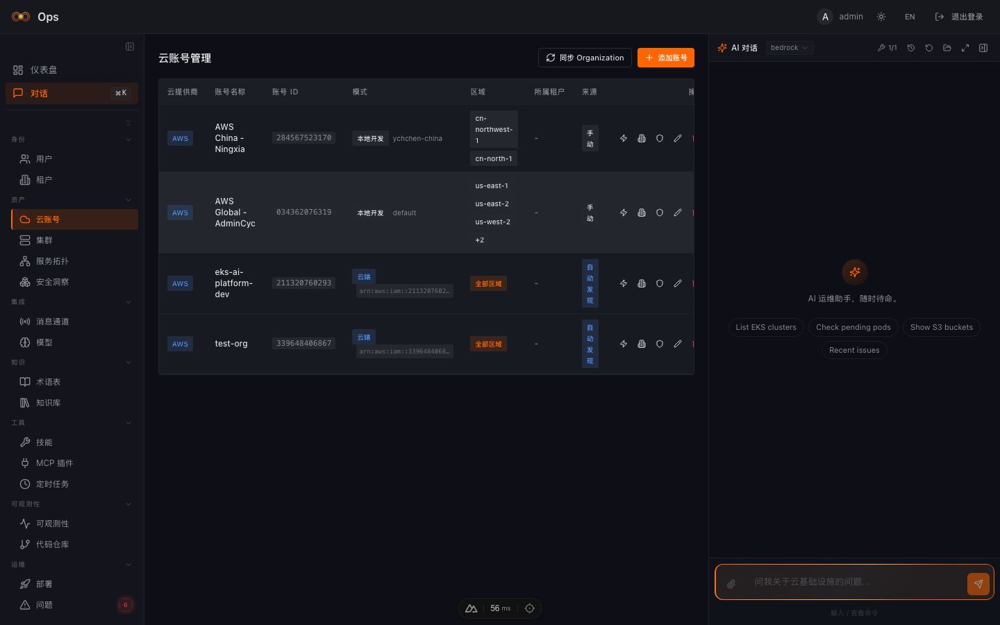

---

## 场景一：Incident RCA — 从告警到根因，3 分钟

### 传统做法

凌晨 3 点，PagerDuty 响了。你爬起来打开电脑：

1. 看 Grafana dashboard 确认哪个服务挂了
2. `kubectl get pods` 看状态，发现 OOMKilled
3. `kubectl logs` 拉日志，翻 50 页找错误
4. 打开 Loki 做 LogQL 查询交叉比对
5. 查 Mimir 指标确认内存曲线
6. 翻 Confluence 找这个服务的 Runbook
7. 30 分钟后写出一个 RCA 初稿

### Loops 做法

告警进来 → 点 "Start RCA" → Claude 自动完成上述所有步骤 → 3 分钟后你收到一份结构化的根因分析报告。

下图是问题管理页面——6 个真实告警按严重程度排列，来源包括 Prometheus、Karpenter、CloudWatch、Security Scanner：

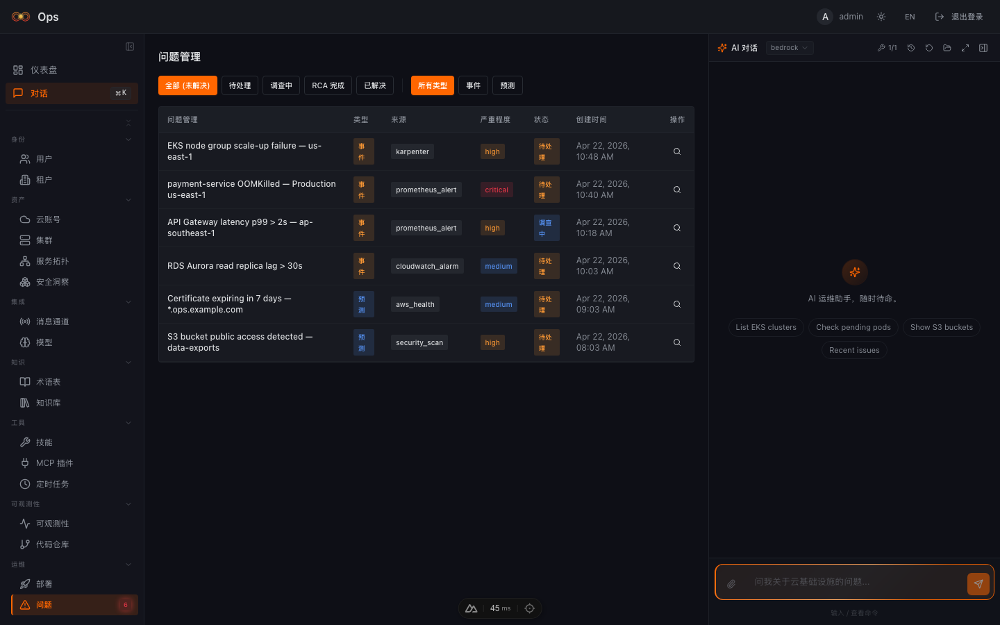

点开 critical 级别的 OOMKilled 告警，可以看到完整的 incident 上下文和 "开始 RCA 分析" 按钮：

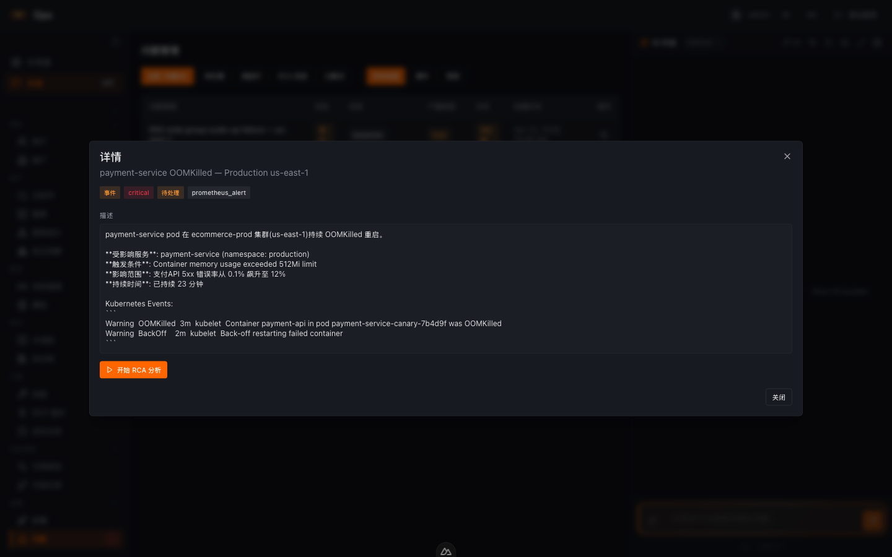

RCA 引擎启动后，你会看到三栏实时流式界面：

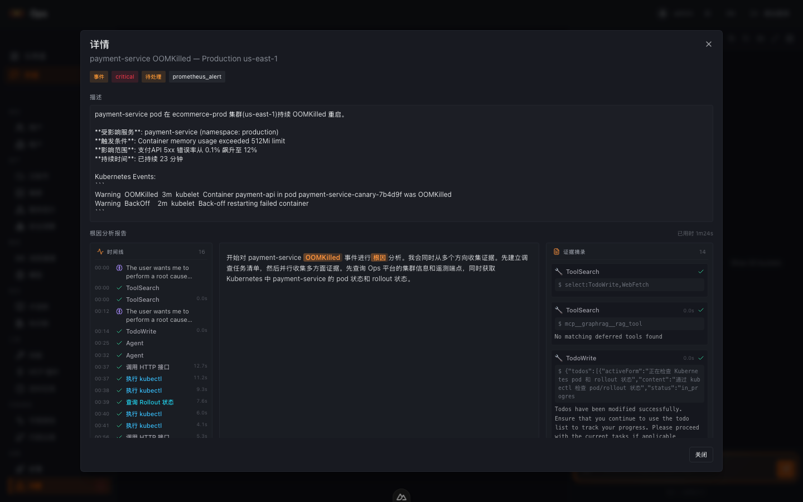

- **左栏 — 时间线 (Timeline)**：每一步工具调用按时间排列——ToolSearch、Agent、kubectl、HTTP 接口调用，16 个步骤全部可展开。
- **中栏 — 分析 (Analysis)**：Claude 的实时推理文本，关键词高亮（**OOMKilled**、CrashLoopBackOff），逐步流式输出。
- **右栏 — 证据摘录 (Evidence)**：每一次工具调用的完整输入输出——kubectl 命令、API 调用、GraphRAG 查询结果，全部可审计。

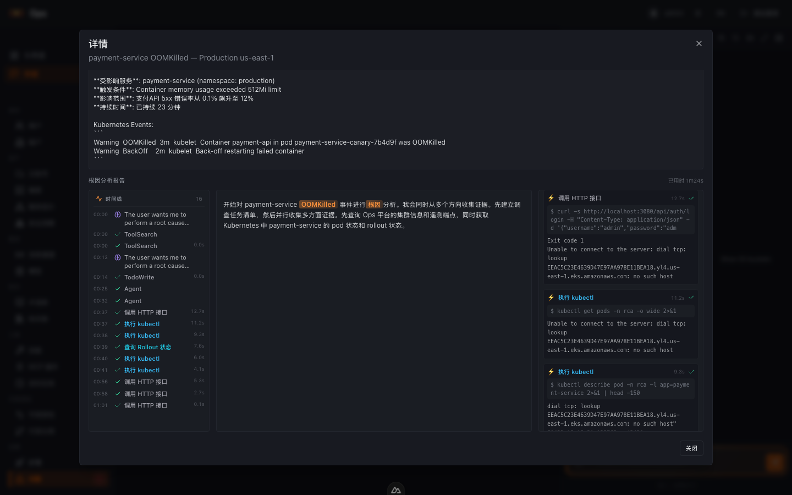

**这不是 prompt engineering 魔术。** Claude Code CLI 在 Bypass 权限模式下运行，可以直接执行 `kubectl`、`curl` 等命令，无需人工确认。System prompt 注入了完整的集群信息、Telemetry endpoint、和 GraphRAG 知识库连接——agent 知道该去哪里查、用什么协议查。

---

## 场景二：Canary Rollout — 逐步发布，AI 守护

### 传统做法

你写了一个 Argo Rollouts 的 canary 配置：5% → 10% → 25% → 50% → 100%。每一步都要：

1. 手动看 AnalysisRun 的指标（error_rate、latency p99）
2. 确认没问题后 `kubectl argo rollouts promote`
3. 如果指标异常，手动 `kubectl argo rollouts abort`
4. 凌晨发版？你得盯着。

### Loops 做法

Deployments 页面直接对接 Argo Rollouts API，实时展示每一步的状态、流量权重、和 AnalysisRun 结果。

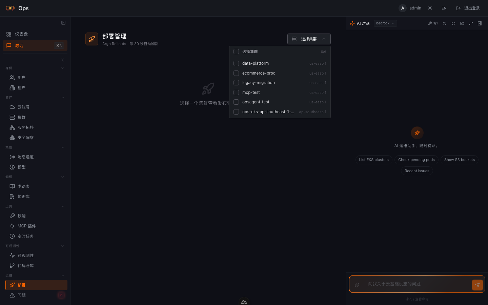

页面上你能看到：

- **Rollout 列表**：按集群筛选（支持多选），实时刷新。每行显示 strategy、current step、canary weight、status。
- **AnalysisRun 指标**：展开行可以看到每个 metric 的 pass/fail 状态——error_rate < 1%? latency_p99 < 500ms?
- **一键操作**：Promote Step（推进一步）、Promote Full（直接全量）、Rollback（中止回滚）。

更强的是 **AI 联动**：在 Chat 中问 "当前 production 的 rollout 状态怎么样？"，Claude 通过 MCP Rollouts 工具直接查询，不需要你切页面。发现问题时甚至可以直接在 Chat 里说 "rollback production 的 canary"。

---

## 场景三：AI Chat 实战 — 自然语言操作基础设施

这不是 "hello world" 演示。以下是真实的运维对话。

### 用例 A：列出 EKS 集群

**你说**："List EKS clusters"（点击快捷按钮）

**Claude 执行**：调用 `/api/clusters` 获取集群列表，自动格式化为表格。

**Claude 返回**：6 个 EKS 集群的完整状态——名称、区域、K8s 版本、平台版本，并主动指出 `ecommerce-prod` 和 `legacy-migration` 版本较低（1.30），建议升级。

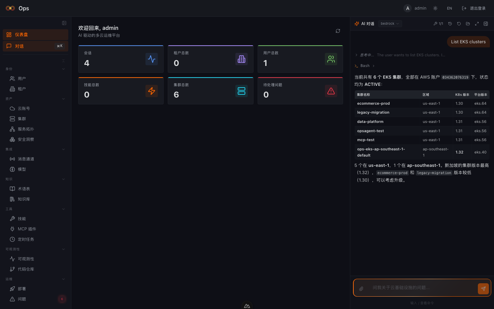

注意看右侧面板——Claude 展开了 thinking 过程和 Bash 工具调用，每一步都可审计。

### 用例 B：告警分析

**你说**："当前有哪些未解决的告警？按严重程度排序"

**Claude 执行**：调用 `/api/issues` 获取告警列表，按 Critical → High → Medium 分级整理。

**Claude 返回**：一份完整的告警分析报告——6 个未解决 issue，按严重程度分三级排列，每个都有来源、状态、影响描述。最后给出 **优先处理建议**：先处理 OOMKilled（正在影响生产支付流量），再修 S3 公开访问（合规风险），再查 API Gateway 延迟。

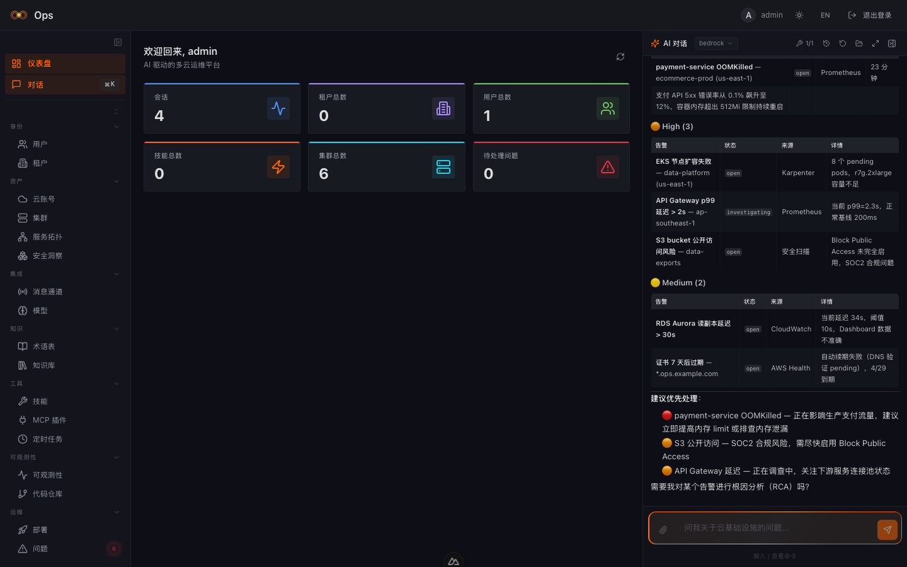

### 用例 C：串联多工具

**你说**："payment-service 好像有点慢，帮我查一下"

**Claude 执行**（自主决定调用链）：
1. `kubectl get pods -n production -l app=payment-service` — 确认 Pod 状态
2. `curl Mimir` — 查 latency p99 指标
3. `curl Loki` — 查最近错误日志
4. `curl Tempo` — 拉慢请求的 trace

**Claude 返回**：一份完整的排查报告——Pod 状态正常，但 p99 从 200ms 飙到 800ms，Loki 日志显示 database connection timeout 增多，建议检查 RDS 连接池配置。

**关键差异：Claude 不是在回答问题，它在做调查。** 它根据 system prompt 中注入的完整基础设施上下文（集群列表、Telemetry endpoint、云账号信息），自主规划调查路径。你给的是方向，不是指令。

---

## 场景四：Security Scanning — 跨账号合规扫描

### 传统做法

打开 AWS Security Hub，切账号看 findings，导出 CSV，手动汇总。中国区？Security Hub 功能阉割版。多账号？每个都要切一遍。

### Loops 做法

一键对任意云账号发起安全扫描（基于 AWS Service Screener），findings 自动归集到统一 dashboard。

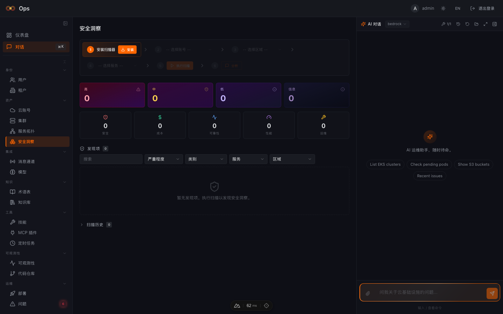

扫描支持：

- **多账号**：AWS Global + AWS 中国区（cn-north-1 / cn-northwest-1），通过 STS AssumeRole 跨账号扫描
- **多维度**：Security、Cost、Reliability、Performance、Operations 五个 category
- **可操作**：每个 finding 展开后有具体的 remediation 步骤
- **向导式操作**：安装扫描器 → 选择账号 → 选择区域 → 选择服务 → 执行扫描 → 查看结果，全流程引导

> **中国区一等公民**：系统通过 `is_china_region()` 自动判断区域，使用中国区专用的 STS endpoint 和 Service Screener 配置。这不是 hack，是设计。

---

## 与 AWS DevOps Agent 的对比

AWS DevOps Agent 于 2026 年 3 月 GA，定位 "always-on AI operations assistant"。两者核心差异：

| 维度 | AWS DevOps Agent | Loops |
|------|-----------------|-------|
| **Runtime 透明度** | 黑盒 frontier agent | Claude Code CLI — 每次工具调用可审计 |
| **中国区** | 不支持 | AWS Global + cn-north-1 + cn-northwest-1 |
| **部署** | AWS SaaS | 你的 K8s，数据不出 VPC |
| **定制** | Agent Space + MCP | System prompt + Skills + MCP + 改源码 |
| **扩展** | 官方 MCP connectors | 任意 MCP server（stdio/SSE/HTTP） |
| **成本** | 按秒计费 + 下游服务费 | 你的云成本，无额外订阅 |

**选 AWS DevOps Agent 如果**：你只用 AWS Global，不想自己运维 AI 平台，接受黑盒。

**选 Loops 如果**：你需要中国区支持、多云、完全透明的工具链、或者想深度定制 agent 行为。

---

## MCP：让 Agent 能力无限扩展

Loops 的 AI agent 不是写死的——通过 MCP（Model Context Protocol），你可以给它插任何工具。

内置 MCP 能力：
- **Rollouts MCP**：`list_rollouts` / `get_rollout_detail` / `promote_rollout` / `rollback_rollout` — Claude 在 Chat 里直接操作 Argo Rollouts
- **GraphRAG MCP**：`rag_tool` — 查询内部知识库和 Runbook，让 RCA 引擎能引用历史经验

自定义扩展：在 MCP 管理页面添加你自己的 MCP server（Slack 通知、Jira 创建、PagerDuty 静默……），下次 Chat 时 Claude 自动获得这些工具的访问权限。

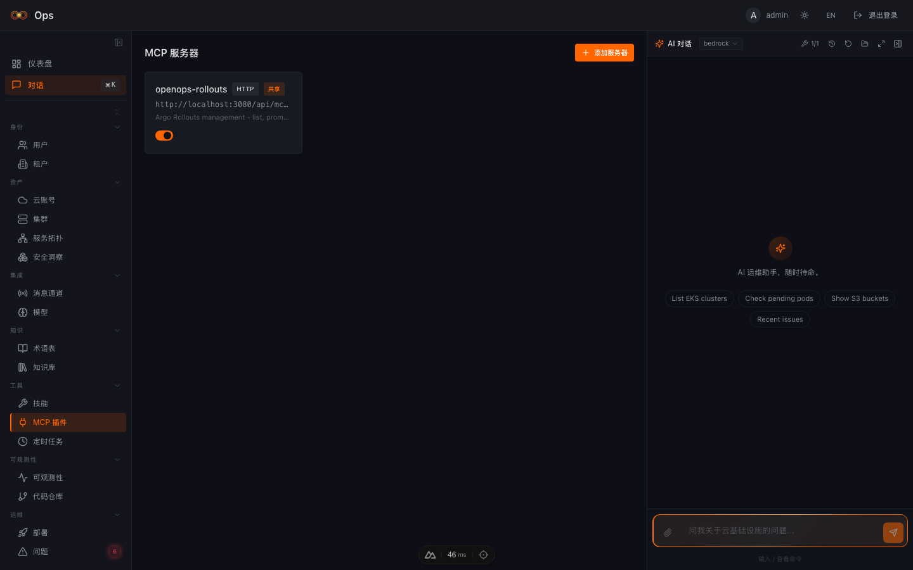

---

## What's Next

这是 Loops 目前在做的事情：

- **Proactive mode** — 不等人问，agent 主动巡检基础设施，发现异常主动告警 + RCA
- **Multi-agent** — 不同 agent 负责不同域（K8s agent、Cloud Cost agent、Security agent），互相协作
- **Runbook 自动生成** — 每次 RCA 的工具调用链自动沉淀为 Runbook，下次类似 incident 直接复用
- **成本优化** — 结合 CloudWatch 指标和 Karpenter 配置，自动推荐 instance 优化建议

---

*系列文章：*
- *第一篇：[为什么我们选 Claude Code CLI 当 SRE Runtime](./claude-code-as-runtime-philosophy.md)*
- *第二篇（本文）：把 Claude Code 当 SRE 用：4 个真实场景*
- *第三篇（WIP）：MCP 生态——让 AI 运维平台真正可扩展*

*项目地址：[GitHub - Loops](https://github.com/loops-labs/loops) · License: MIT*
