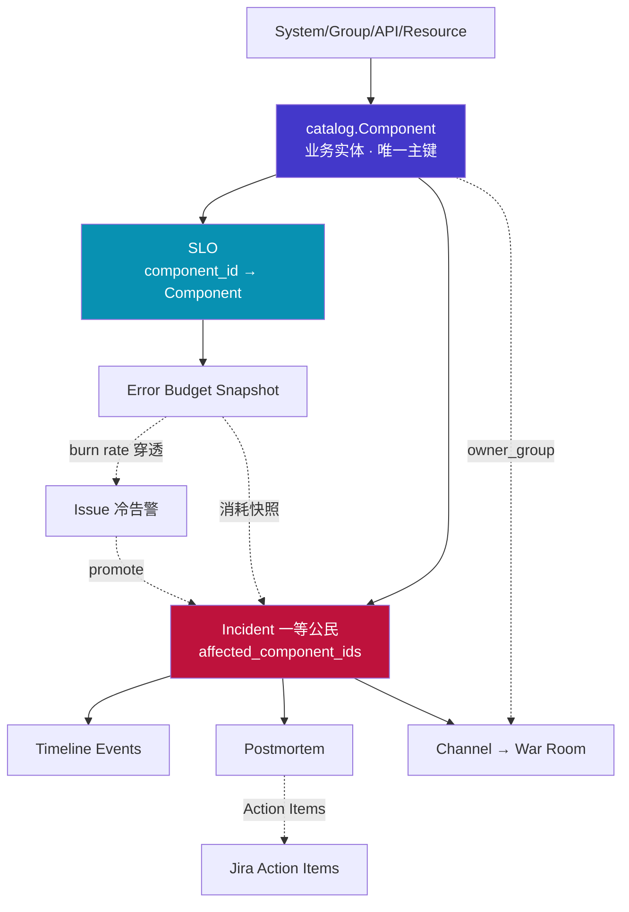
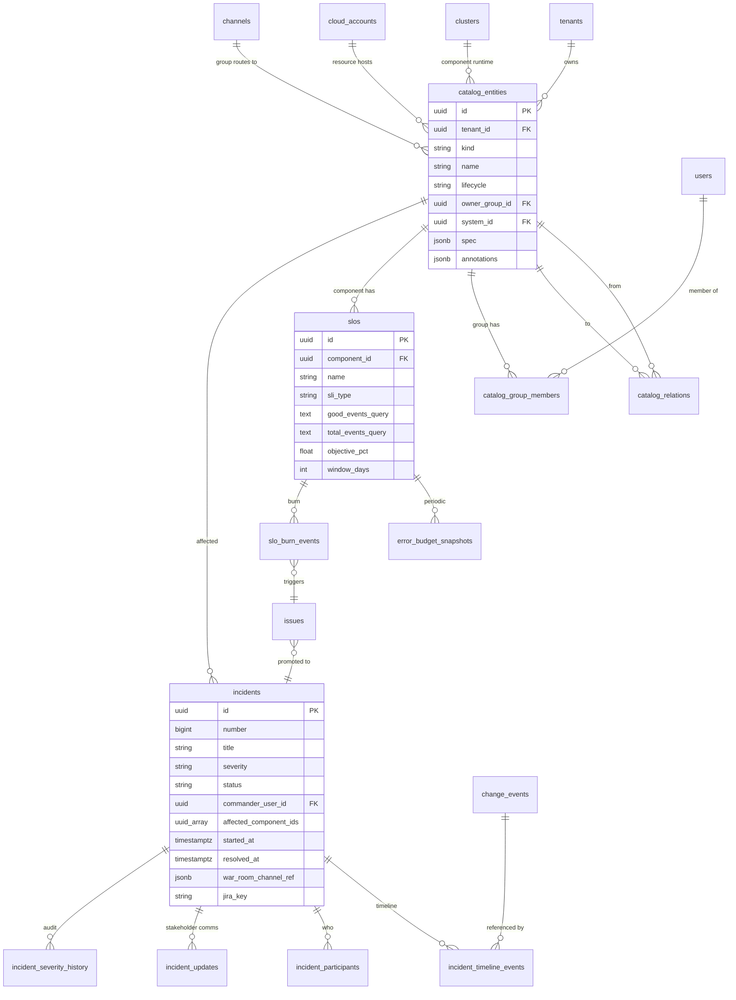
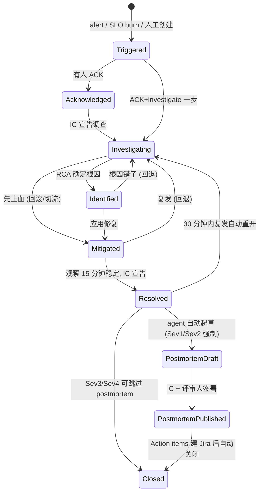
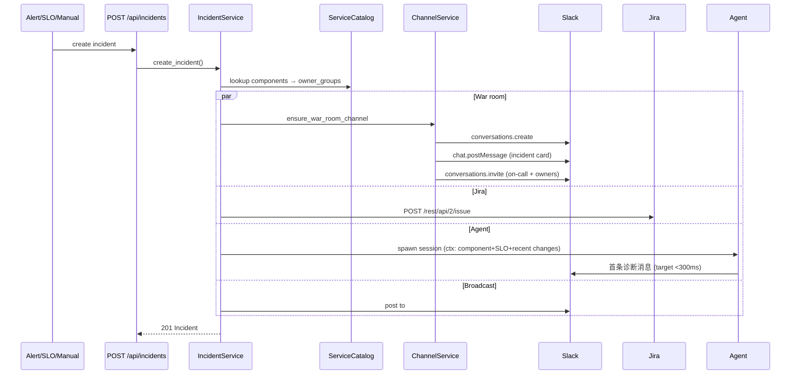

# Loops 平台演进规划

> 从 "AI 驱动的多云可观测 + 发布平台" 升级为 **AI-native SRE + 平台工程双栖平台**

版本：v1 · 2026-05-02 起草

---

## 一、背景与定位

### 当前状态

Loops 今天具备的能力：

- AI Agent (Claude + MCP + Skills)，能执行真实工具、流式 RCA
- 多云账户/集群自动发现 (AWS Organizations、EKS)
- 可观测性聚合 (Mimir/Loki/Tempo + CloudWatch/X-Ray)
- Argo Rollouts 集成 (canary/bluegreen/promote/rollback)
- Service Screener 安全扫描
- 多租户、RBAC、Provider、Channel (Slack/Feishu/Teams)、Approval、Scheduled Jobs

### 对标差距 (AWS DevOps Agent + Backstage)

| 维度 | Loops 现状 | 差距定性 |
|------|-----------|---------|
| AI 对话运维 | ✅ 强 | **领先** |
| 多云可观测聚合 | ✅ 强 | **领先** |
| 自助式部署 | ✅ 强 | **领先** |
| Service Catalog (业务实体) | ❌ 几乎没有 | **最大缺口** |
| SLO / Error Budget | ❌ 没有 | **真 SRE 的分水岭** |
| Incident 生命周期 | ⚠️ 只有 issue list | **关键缺口** |
| Golden Path Scaffolding | ❌ 没有 | 平台工程核心 |
| 变更时间线关联 | ⚠️ 事件孤岛 | 高价值缺口 |
| Runbook 自动化 | ⚠️ skill 重叠但概念缺失 | 需概念升级 |
| 成本/FinOps | ❌ 没有 | 缺口 |
| 服务依赖图 (from traces) | ❌ | 缺口 |

### 战略选择

**定位**: AI-native SRE platform (不做 Backstage 克隆，不做 Rootly 克隆)。护城河是 "AI agent + 实时工具执行 + 多云" 的组合，对标产品里 Backstage 无 AI，AWS DevOps Agent 无可视化深度，Rootly 无多云。

**本轮做什么**: 三个核心模块必须一起做，因为彼此咬合 —— Service Catalog、SLO 引擎、Incident Command Center。

**明确不做 (本阶段)**: Chaos Engineering、OPA 策略引擎、Rightsizing、Golden Path Scaffolding、FinOps、Dependency Graph from Traces。这些是平台成熟度动作，没有 Catalog 和 SLO 骨架，单独做只是散点。

---

## 二、整体架构

### 2.1 三个模块围绕 Component 脊柱



> 没有 Catalog，SLO 没有归属、Incident 没有 owner；没有 SLO，Incident 没有"严重性判断依据"；没有 Incident，Catalog 和 SLO 只是两份漂亮仪表盘。

### 2.2 核心数据脊柱 ERD



### 2.3 前端信息架构

不是给 Catalog/SLO/Incident 各开一个顶级菜单，而是以 Service (Component) 为中心聚合：

```
┌─ Loops Portal ─────────────────────────────────────────────┐
│ Services (Catalog)  │  SLOs  │  Incidents  │  Changes     │
│                                                             │
│ 单个 Service 页 (/services/:id)                             │
│  ├─ [Overview]   owner/runtime/dependencies                 │
│  ├─ [SLOs]       所有 SLO + budget + burn                  │
│  ├─ [Incidents]  历史 incidents + active                    │
│  ├─ [Changes]    deploy/config 时间线                      │
│  ├─ [Runbooks]   关联的 skills/MCP                          │
│  └─ [Docs]       knowledge base                             │
└──────────────────────────────────────────────────────────────┘
```

顶级菜单 4 个就够了。比 Backstage 的 plugin-centric 架构更清爽。

---

## 三、模块一：Service Catalog (Loops Catalog)

### 3.1 设计目标

Backstage 简化版，面向 SRE 场景优化。核心价值：把现有 cluster/pod/account 的「基础设施视角」和业务代码的「产品视角」通过 Component 打通，成为 SLO、Incident、Channel、RCA 的公共主键。

### 3.2 Entity 模型

5 类实体，公共字段走单表 + `kind` 区分 + `spec` JSONB 扩展：

```rust
pub struct CatalogEntity {
    pub id: Uuid,
    pub tenant_id: Uuid,
    pub kind: String,                    // system | component | api | resource | group
    pub name: String,                    // tenant+kind 内唯一
    pub display_name: Option<String>,
    pub description: Option<String>,
    pub lifecycle: String,               // production | experimental | deprecated | retired
    pub owner_group_id: Option<Uuid>,    // → catalog_entities(id) where kind='group'
    pub system_id: Option<Uuid>,
    pub tags: Vec<String>,
    pub annotations: serde_json::Value,  // github.com/slug, pagerduty/id...
    pub source_url: Option<String>,      // repo 地址
    pub source_ref: Option<String>,      // commit sha
    pub spec: serde_json::Value,         // kind 专属字段
    pub created_at: DateTime<Utc>,
    pub updated_at: DateTime<Utc>,
}
```

各 kind 的 `spec` 结构（用 TS/Rust 枚举统一约束）：

- **System**: `{ domain: string }` — 如 payments, identity
- **Component**: `{ component_type, language, consumes_apis[], provides_apis[], depends_on_resources[], runtime: { kind, cluster_id, namespace, workload_name, aws_arn } }` — 核心
- **API**: `{ api_type, definition_url, owned_by_component_id }`
- **Resource**: `{ resource_type, cloud_account_id, region, external_ref }`
- **Group**: `{ email, slack_channel, default_channel_id, parent_group_id }`

### 3.3 核心表 DDL

```sql
CREATE TABLE IF NOT EXISTS catalog_entities (
    id UUID PRIMARY KEY DEFAULT gen_random_uuid(),
    tenant_id UUID NOT NULL REFERENCES tenants(id) ON DELETE CASCADE,
    kind VARCHAR(32) NOT NULL
        CHECK (kind IN ('system','component','api','resource','group')),
    name VARCHAR(128) NOT NULL,
    display_name VARCHAR(256),
    description TEXT,
    lifecycle VARCHAR(32) NOT NULL DEFAULT 'experimental'
        CHECK (lifecycle IN ('production','experimental','deprecated','retired')),
    owner_group_id UUID REFERENCES catalog_entities(id) ON DELETE SET NULL,
    system_id UUID REFERENCES catalog_entities(id) ON DELETE SET NULL,
    tags TEXT[] NOT NULL DEFAULT '{}',
    annotations JSONB NOT NULL DEFAULT '{}',
    source_url TEXT,
    source_ref VARCHAR(128),
    spec JSONB NOT NULL DEFAULT '{}',
    created_at TIMESTAMPTZ NOT NULL DEFAULT NOW(),
    updated_at TIMESTAMPTZ NOT NULL DEFAULT NOW(),
    UNIQUE (tenant_id, kind, name)
);
CREATE INDEX idx_catalog_entities_tenant_kind ON catalog_entities(tenant_id, kind);
CREATE INDEX idx_catalog_entities_owner ON catalog_entities(owner_group_id);
CREATE INDEX idx_catalog_entities_tags ON catalog_entities USING GIN (tags);
CREATE INDEX idx_catalog_entities_annotations ON catalog_entities USING GIN (annotations);
CREATE INDEX idx_catalog_entities_runtime_cluster
    ON catalog_entities ((spec->'runtime'->>'cluster_id'))
    WHERE kind = 'component';

CREATE TABLE IF NOT EXISTS catalog_relations (
    id UUID PRIMARY KEY DEFAULT gen_random_uuid(),
    from_id UUID NOT NULL REFERENCES catalog_entities(id) ON DELETE CASCADE,
    to_id UUID NOT NULL REFERENCES catalog_entities(id) ON DELETE CASCADE,
    relation_type VARCHAR(32) NOT NULL
        CHECK (relation_type IN ('owns','provides','consumes','depends_on','part_of','deployed_on')),
    created_at TIMESTAMPTZ NOT NULL DEFAULT NOW(),
    UNIQUE (from_id, to_id, relation_type)
);

CREATE TABLE IF NOT EXISTS catalog_group_members (
    group_id UUID NOT NULL REFERENCES catalog_entities(id) ON DELETE CASCADE,
    user_id UUID NOT NULL REFERENCES users(id) ON DELETE CASCADE,
    role VARCHAR(32) NOT NULL DEFAULT 'member'
        CHECK (role IN ('owner','member')),
    PRIMARY KEY (group_id, user_id)
);

CREATE TABLE IF NOT EXISTS catalog_import_runs (
    id UUID PRIMARY KEY DEFAULT gen_random_uuid(),
    tenant_id UUID NOT NULL REFERENCES tenants(id) ON DELETE CASCADE,
    source VARCHAR(32) NOT NULL,   -- github_org | git_url | k8s_discovery | manual
    source_ref TEXT,
    entities_created INT NOT NULL DEFAULT 0,
    entities_updated INT NOT NULL DEFAULT 0,
    errors JSONB NOT NULL DEFAULT '[]',
    started_at TIMESTAMPTZ NOT NULL DEFAULT NOW(),
    completed_at TIMESTAMPTZ
);
```

### 3.4 catalog-info.yaml 示例

放在每个 repo 根目录，一个 YAML 可声明多个 entity（`---` 分隔）：

```yaml
apiVersion: loops.yingchu.cloud/v1
kind: Component
metadata:
  name: order-api
  displayName: Order API
  description: REST API serving order placement & lookup
  tags: [rust, critical-path]
  annotations:
    github.com/slug: acme/order-api
    pagerduty.com/service-id: PX12ABC
spec:
  type: service
  lifecycle: production
  language: rust
  owner: group:payments-team
  system: payments
  providesApis: [order-api-v1]
  consumesApis: [user-api-v1, payment-gateway-v2]
  dependsOn:
    - resource:orders-rds
    - resource:orders-kafka-topic
  runtime:
    kind: eks
    cluster: prod-us-west-2
    namespace: payments
    workload: order-api
---
apiVersion: loops.yingchu.cloud/v1
kind: API
metadata:
  name: order-api-v1
spec:
  type: openapi
  owner: group:payments-team
  system: payments
  definition: https://github.com/acme/order-api/blob/main/openapi.yaml
```

### 3.5 API Endpoints

```
GET    /api/catalog/entities                  # 列表，支持 ?kind=&system=&owner=&lifecycle=&tag=&q=
GET    /api/catalog/entities/{id}             # 详情（含 owner/system/relations 展开）
POST   /api/catalog/entities                  # 手动创建
PUT    /api/catalog/entities/{id}             # 更新
DELETE /api/catalog/entities/{id}             # 删除（级联 relations）
GET    /api/catalog/entities/{id}/relations   # 出入边
GET    /api/catalog/entities/{id}/graph?depth=2
POST   /api/catalog/import/yaml               # 粘贴 YAML 导入
POST   /api/catalog/import/repo               # { repo_url, ref } 克隆解析
POST   /api/catalog/import/github-org         # 批量扫 org 所有 repo
POST   /api/catalog/discover/k8s              # 扫 cluster，自动建 Component 骨架
GET    /api/catalog/import-runs               # 审计历史
GET    /api/catalog/groups/{id}/members
```

### 3.6 自动发现策略

**K8s 侧** (`/api/catalog/discover/k8s`)：

1. 扫每个 cluster 的 Deployment / Rollout / StatefulSet
2. 标签优先级：`app.kubernetes.io/part-of` → system name，`app.kubernetes.io/name` → component name，`app.kubernetes.io/owner` → owner_group
3. 已存在：**只更新 `spec.runtime`，YAML 是权威源**；不存在：建 `lifecycle=experimental` + `owner_group=null` 占位，前端打「未认领」徽章
4. 通过 scheduled_job 每日增量同步

**GitHub 组织批量导入** (`/api/catalog/import/github-org`)：

1. GitHub App / PAT 存 Secrets Manager (复用现有路径)
2. `GET /orgs/{org}/repos` 分页 → `GET /repos/{owner}/{repo}/contents/catalog-info.yaml` (404 跳过)
3. 解析 YAML → upsert `catalog_entities`，记录 `source_url` + `source_ref`
4. 失败项落 `catalog_import_runs.errors`，前端红黄绿导入报告

---

## 四、模块二：SLO 引擎

### 4.1 设计目标

引入 SLO / SLI / Error Budget / Burn Rate 概念。让平台从"告警聚合器"升级为"真 SRE 平台"。存 PromQL 字符串，不存结构化 DSL — 对 Prometheus 生态最直接。

### 4.2 数据模型

```rust
pub struct Slo {
    pub id: Uuid,
    pub tenant_id: Uuid,
    pub component_id: Option<Uuid>,       // FK → catalog_entities (kind='component')
    pub name: String,
    pub description: Option<String>,
    pub sli_type: String,                 // availability | latency | error_rate | custom
    pub good_events_query: String,        // PromQL 分子
    pub total_events_query: String,       // PromQL 分母
    pub objective_pct: f64,               // 99.9 (不是 0.999 — 人类可读)
    pub window_days: i32,                 // 7 | 28 | 30
    pub burn_rate_policy: String,         // mwmbr_default | custom_v1
    pub labels: JsonValue,
    pub enabled: bool,
    pub recording_rules_hash: Option<String>,  // 同步状态跟踪
    pub created_by: Uuid,
    pub created_at: DateTime<Utc>,
    pub updated_at: DateTime<Utc>,
}

pub struct ErrorBudgetSnapshot {
    pub id: Uuid,
    pub slo_id: Uuid,
    pub captured_at: DateTime<Utc>,
    pub window_start: DateTime<Utc>,
    pub window_end: DateTime<Utc>,
    pub sli_achieved_pct: f64,
    pub budget_total_minutes: f64,
    pub budget_consumed_minutes: f64,
    pub budget_remaining_pct: f64,
    pub burn_rate_1h: f64,
    pub burn_rate_6h: f64,
    pub burn_rate_24h: f64,
    pub burn_rate_3d: f64,
}

pub struct SloBurnEvent {
    pub id: Uuid,
    pub slo_id: Uuid,
    pub severity: String,                 // page | ticket
    pub window: String,                   // "1h" | "6h" | "3d"
    pub burn_rate: f64,
    pub threshold: f64,
    pub triggered_at: DateTime<Utc>,
    pub resolved_at: Option<DateTime<Utc>>,
    pub issue_id: Option<Uuid>,
}
```

Snapshot 每 5 min 由 tokio 后台任务写一次，用于历史图；实时查询直连 Mimir。

### 4.3 Recording Rules 生成

SLO 创建后，后端渲染 Prometheus rule group，通过 Mimir ruler API 推送。Group 名 = `slo_{slo_id_short}`。

**HTTP availability SLO 示例**：

```yaml
groups:
- name: slo_7a3c.availability
  interval: 30s
  rules:
  - record: sli:slo_7a3c:good_events:rate5m
    expr: sum(rate(http_requests_total{job="checkout",code!~"5.."}[5m]))
  - record: sli:slo_7a3c:total_events:rate5m
    expr: sum(rate(http_requests_total{job="checkout"}[5m]))
  - record: sli:slo_7a3c:ratio_rate5m
    expr: sli:slo_7a3c:good_events:rate5m / sli:slo_7a3c:total_events:rate5m
  - record: sli:slo_7a3c:ratio_rate1h
    expr: sum_over_time(sli:slo_7a3c:good_events:rate5m[1h])
       / sum_over_time(sli:slo_7a3c:total_events:rate5m[1h])
  - record: sli:slo_7a3c:ratio_rate6h
    expr: sum_over_time(sli:slo_7a3c:good_events:rate5m[6h])
       / sum_over_time(sli:slo_7a3c:total_events:rate5m[6h])
  - record: sli:slo_7a3c:ratio_rate3d
    expr: sum_over_time(sli:slo_7a3c:good_events:rate5m[3d])
       / sum_over_time(sli:slo_7a3c:total_events:rate5m[3d])
```

**Latency SLO** (p99 < 500ms)：

```yaml
- record: sli:slo_9f2b:good_events:rate5m
  expr: sum(rate(http_request_duration_seconds_bucket{job="api",le="0.5"}[5m]))
- record: sli:slo_9f2b:total_events:rate5m
  expr: sum(rate(http_request_duration_seconds_count{job="api"}[5m]))
```

### 4.4 Multi-Window Multi-Burn-Rate (MWMBR)

按 Google SRE book 第 5 章。两对窗口消除 flappy 告警（短窗口触发，长窗口确认）：

| 级别 | 长窗口 burn | 短窗口 burn | 含义 |
|------|-----------|-----------|------|
| Page (P1) | 1h @ 14.4x | 5m @ 14.4x | 1h 烧 2% 预算 |
| Page (P2) | 6h @ 6x | 30m @ 6x | 6h 烧 5% 预算 |
| Ticket | 3d @ 1x | 6h @ 1x | 3d 烧 10% |
| Ticket | 7d @ 1x | 1d @ 1x | 慢漏 |

`burn_rate = (1 - SLI) / (1 - SLO)`。SLO=0.999 时 burn=14.4 意味着错误率是容忍值的 14.4 倍。

**生成的 Alerting rule 示例** (objective=99.9)：

```yaml
- alert: SloBurnFast_7a3c_Page
  expr: |
    (
      (1 - sli:slo_7a3c:ratio_rate1h) > (14.4 * (1 - 0.999))
      and
      (1 - sli:slo_7a3c:ratio_rate5m) > (14.4 * (1 - 0.999))
    )
  for: 2m
  labels:
    severity: page
    slo_id: "7a3c..."
    burn_window: "1h"
```

告警走 Grafana Alertmanager → 现有 `POST /api/alerts` webhook，由 label `slo_id` 识别。**不新建管道**。

### 4.5 Error Budget 计算

```rust
impl BudgetCalc {
    pub fn total_minutes(objective_pct: f64, window_days: i32) -> f64 {
        let err_budget = 1.0 - objective_pct / 100.0;
        err_budget * (window_days as f64) * 1440.0
    }
    pub fn consumed_minutes(sli_achieved_pct: f64, window_days: i32) -> f64 {
        let miss_rate = 1.0 - sli_achieved_pct / 100.0;
        miss_rate * (window_days as f64) * 1440.0
    }
    pub fn burn_rate(sli_ratio: f64, objective_pct: f64) -> f64 {
        let err_rate = 1.0 - sli_ratio;
        let budget_rate = 1.0 - objective_pct / 100.0;
        if budget_rate == 0.0 { return 0.0; }
        err_rate / budget_rate
    }
}
```

### 4.6 前端面板 (ASCII 草图)

**SLO 列表** (`/slos`)：

```
┌─────────────────────────────────────────────────────────────────────────┐
│ SLOs                                        [+ New SLO]  [Bulk sync]   │
├──────────────┬──────────┬────────┬──────────┬────────────┬──────────────┤
│ Name         │ Service  │ Target │ SLI 28d  │ Budget     │ Burn (1h/6h) │
├──────────────┼──────────┼────────┼──────────┼────────────┼──────────────┤
│ checkout-avail│ checkout │ 99.9%  │ 99.73% 🔴│ ▓▓▓░░ 42%  │ 18.2x🔴 8.1x🔴│
│ api-latency  │ api      │ 99.0%  │ 99.31% 🟢│ ▓▓▓▓▓ 78%  │ 0.3x 🟢 0.2x🟢│
│ login-errors │ auth     │ 99.5%  │ 99.48% 🟡│ ▓▓░░░ 22%  │ 2.1x 🟡 1.4x🟡│
└──────────────┴──────────┴────────┴──────────┴────────────┴──────────────┘
```

**SLO 详情页** (`/slos/:id`)：

```
┌─────────────────────────────────────────────────────────────────────────┐
│ ← checkout-avail                         [Edit] [Disable] [Sync rules] │
│ Target 99.9% · 28d rolling · component: checkout · owner: payments     │
├─────────────────────────────────────────────────────────────────────────┤
│ ┌ Error Budget ────────────────┐  ┌ Burn Rate ────────────────┐        │
│ │  Consumed   Remaining        │  │         1h    6h    1d    │        │
│ │  ▓▓▓▓░░░░░   42%             │  │  burn  18.2x  8.1x  3.2x  │        │
│ │  17.2 min / 40.3 min         │  │  🔴 PAGE active           │        │
│ │  Depleted in ~3h @ current   │  │                           │        │
│ └──────────────────────────────┘  └───────────────────────────┘        │
│                                                                         │
│ ┌ SLI time series (28d) ──────────────────────────────────────────────┐│
│ │ 100%┤  ─────╲─────────────╲╱──────                                  ││
│ │     │        ╲             ╲ ← burn event #3                        ││
│ │  99%┤─────────╲─── target ──╲────                                   ││
│ │     └──────────────────────────────────────────── now               ││
│ └────────────────────────────────────────────────────────────────────┘│
│                                                                         │
│ ┌ Burn history ─────────────────────────────────────────────────────┐ │
│ │ 2026-04-30 14:22  PAGE  1h 14.4x  issue #4821 [RESOLVED 14m]     │ │
│ │ 2026-04-28 09:11  TICKET 3d 1.2x  issue #4789 [ACTIVE]           │ │
│ └───────────────────────────────────────────────────────────────────┘ │
└─────────────────────────────────────────────────────────────────────────┘
```

### 4.7 Agent 集成点

**Incident 上下文自动注入**：RCA pipeline 组装 prompt 时读该 component 的所有 active SLO + 当前 budget，注入形如：

```
[SLO checkout-avail: 99.9% target, currently burning 18.2x,
 42% budget left (~3h to deplete)]
```

**新增 MCP tools**：

- `slo_query` — 查 service/component 当前 SLO 状态
- `slo_forecast` — 按当前 burn rate 预测预算耗尽时间

**严重性决策规则** (prompt 指导)：

- budget > 50% → informational RCA
- 20%–50% → 标准 RCA + suggest remediation
- < 20% → urgent, recommend rollback / feature-flag-kill
- < 0% → P1，触发 blameless postmortem workflow

---

## 五、模块三：Incident Command Center

### 5.1 设计目标

Incident 作为一等公民。从当前"冷告警列表"升级到有生命周期、自动化、时间线、postmortem 的完整事件响应系统。

### 5.2 数据模型

```rust
pub struct Incident {
    pub id: Uuid,
    pub tenant_id: Option<Uuid>,
    pub number: i64,                          // INC-2026-0042 (租户内自增)
    pub title: String,
    pub severity: IncidentSeverity,           // Sev1..Sev4
    pub status: IncidentStatus,
    pub commander_user_id: Option<Uuid>,
    pub scribe_user_id: Option<Uuid>,
    pub impact_summary: Option<String>,
    pub affected_component_ids: Vec<Uuid>,    // → catalog_entities
    pub affected_customer_tier: Option<String>,
    pub detection_source: DetectionSource,    // alert | manual | slo_burn | chaos | synthetic
    pub source_issue_id: Option<Uuid>,        // 由 issues 晋升来
    pub started_at: DateTime<Utc>,
    pub detected_at: DateTime<Utc>,
    pub acknowledged_at: Option<DateTime<Utc>>,
    pub mitigated_at: Option<DateTime<Utc>>,
    pub resolved_at: Option<DateTime<Utc>>,
    pub closed_at: Option<DateTime<Utc>>,
    pub war_room_channel_ref: Option<ChannelRef>,
    pub bridge_url: Option<String>,
    pub jira_key: Option<String>,
    pub postmortem_doc_ref: Option<DocRef>,
    pub root_cause: Option<String>,
    pub root_cause_category: Option<String>,  // deploy | config | capacity | dependency | bug | infra
    pub labels: JsonValue,
    pub slo_budget_burn: Option<JsonValue>,   // {"order-api.availability": 0.12}
    pub merged_into_id: Option<Uuid>,
    pub created_at: DateTime<Utc>,
    pub updated_at: DateTime<Utc>,
}
```

附表：`incident_timeline_events`, `incident_participants`, `incident_updates`, `incident_severity_history`（详细结构见代码实现）。

### 5.3 状态机



**严重度规则**：

- 初始严重度来自 `detection_source`: alert `labels.severity` / SLO 策略 severity / 人工
- **升级触发** (系统建议, IC 确认):
  - 持续 >30min 仍未 Mitigated → Sev3→Sev2
  - affected_component 含 `tier=tier0` → 至少 Sev2
  - ≥2 个 Sev3 merge 进同一 incident → Sev2
- **降级**: 只允许 IC 手动，必填 reason

### 5.4 War Room 自动化



Channel 命名规范：`#inc-YYYYMMDD-<kebab-title-40>`，例 `#inc-20260502-checkout-p99-spike`。Closed 后 7 天自动归档。

### 5.5 Timeline 事件聚合

**全部 push，不 polling**。内部用 tokio broadcast channel `incident_bus` 分发给 ① 写 DB, ② SSE 推前端, ③ 可选重播到 Slack。

| Kind | 来源 | 接入方式 |
|------|------|---------|
| `alert_fired` / `alert_cleared` | Grafana/Datadog/Dynatrace webhook | 现有 `handlers/alerts.rs` 扩展 |
| `incident_status_changed` | 内部 | 状态机 transition 钩子 |
| `incident_severity_changed` | 内部 | 同上 |
| `deploy_started` / `deploy_succeeded` / `deploy_failed` | ArgoCD webhook + Rollouts controller | 现有 `argocd_webhook.rs` 扩展 |
| `rollback_initiated` | Argo Rollouts abort/undo | 现有 `handlers/rollout.rs` |
| `agent_tool_call` | AgentEvent::ToolUse | `chat.rs` 保存 chat_messages 时同时写 timeline |
| `agent_insight` | Agent 带 `[timeline]` tag 的文本 | 解析 Text event |
| `ack` / `assign_ic` / `join` / `leave` | 前端/Slack slash cmd | 交互 handler |
| `comment` / `manual_note` | 人工 | `POST /incidents/{id}/comments` |
| `runbook_executed` | Skill/MCP `execute_runbook` | 工具结果回调 |
| `update_published` | IncidentUpdate 发布 | 状态机 |
| `slo_burn_threshold` | SLO 引擎 cron | 穿透阈值时写 |
| `feature_flag_changed` | LD/Unleash webhook | 未来 |

### 5.6 Postmortem 自动生成

**触发**: Incident 进入 Resolved，若 severity ∈ {Sev1, Sev2} 自动，Sev3+ 可选。

**工作流**:

1. `services::postmortem::draft()` 收集 context：
   - `timeline_events` 全量
   - 关联 chat session 的 RCA 文档
   - `deployment_events` 时段内变更
   - Mimir 四黄金信号快照：`started_at - 30min` 到 `resolved_at + 15min`
   - 向量检索过去 90 天 3 个相似 root_cause incident
2. 调 agent (新 session, system=postmortem_writer, model=Opus, readonly 工具集)
3. 模板 (Google SRE 风格，中文)：Summary / Impact / Root Cause / Detection / Resolution / Timeline / Action Items / Lessons Learned
4. 产出：
   - 存 `knowledge_base` 新增 `kind='postmortem'`
   - `incident.postmortem_doc_ref` 指向该行
   - Action Items 自动 `POST /api/jira/create` 生成 ticket

### 5.7 作战室页面 (ASCII 草图)

```
┌──────────────────────────────────────────────────────────────────────┐
│ ← INC-2026-0042   SEV2 ▼   Investigating ▼   ⏱ 12m 04s              │
│ Checkout p99 spike — 40% 5xx on order-api                            │
│ IC: wchen | Responders: 4 | Bridge · Slack · Jira OPS-1234 · Runbook │
├─────────────────────────┬────────────────────────────────────────────┤
│ AFFECTED SERVICES       │ TIMELINE (live SSE)                        │
│ ● order-api        🔴  │ 12:04 [alert] Grafana CheckoutP99 fired    │
│ ● payment-gw       🟡  │ 12:04 [system] Incident INC-0042 created   │
│                         │ 12:05 [agent] 🧰 fetched last 3 deploys    │
│ SLO IMPACT              │ 12:06 [agent] hypothesis: deploy v1.42...  │
│ availability  88% →77%  │ 12:07 [user wchen] ACK, investigating      │
│ budget burned 12%       │ 12:09 [deploy] rollback v1.42 → v1.41      │
│                         │ 12:11 [agent] p99 dropping 340ms → 95ms    │
│ RECENT CHANGES (30m)    │ [+ Add note]                               │
│ ArgoCD: order-api v1.42 │ ─────────────────────────────────          │
│ Config: ld flag ON      │ UPDATES (stakeholder)                      │
│                         │ [Draft update]                             │
│ PARTICIPANTS (4)        │ 12:08 Internal — Investigating p99 spike   │
│ wchen (IC) yrao (SRE)   │                                            │
├─────────────────────────┴────────────────────────────────────────────┤
│ AGENT CHAT (session inc-0042 copilot)   [Promote | Rollback]         │
│ > 分析一下过去 30 分钟 order-api 的 latency 热点                      │
│ ...streaming agent response...                                       │
└──────────────────────────────────────────────────────────────────────┘
```

### 5.8 Agent 集成点

- **自动召唤**: `create_incident` 完成后立刻 spawn agent session，output 同时回流 Slack war room + 前端 chat panel
- **初始 context**: title/severity/impact/affected_components + `GET /api/components/:id` (owner/runbook/deps) + 过去 30min deployment_events + 关联 active SLO + 向量搜索的 3 个相似历史 incident
- **新 MCP tools**：
  - `incident.post_timeline_note`
  - `incident.suggest_severity_change`
  - `incident.propose_update_draft`
  - `runbook.execute` (readonly 或 canary-only)
  - `rollout.rollback` / `rollout.promote` 加 `requires_ic_approval=true` 标志

---

## 六、跨模块决策 (现在必须拍板)

这些是三个模块咬合处，现在不定后期改代价巨大：

### 6.1 五个必须现在拍板的决策

| # | 决策点 | 选项 | **拍板** |
|---|--------|------|---------|
| 1 | Component 的 runtime 绑定方式 | (a) JSONB `spec.runtime.*` (b) 新增 `rollout_ref` 字段列 | **(a) JSONB**：灵活、向后兼容、SLO/Incident 都从 `spec.runtime` 读 |
| 2 | Issue vs Incident 的分工 | (a) 合并 (b) Issue 冷告警 + Incident 热事件两级 | **(b) 两级**：alert→issue→(规则或人工 promote)→incident。tier0 service 自动 promote |
| 3 | SLO burn 是否自动触发 Incident | (a) 全部自动 (b) 仅 Page 级自动 (c) 全部人工 | **(b)**: Page 级 burn (14.4x@1h) 自动 promote，Ticket 级仅落 issue |
| 4 | Agent session 和 incident/SLO 的关系 | (a) 每种实体独立 FK 列 (b) 统一 context_type/context_id | **(b)**: `claude_sessions` 加 `context_type` (`incident`\|`slo`\|`component`\|`free`) + `context_id`，不为每种新增 FK |
| 5 | Timeline 的范围 | (a) incident-scoped (b) 全局 change_events + 按 incident 投影 | **(b)**: 新增 `change_events` 全局表 (非 incident 期间也记录)，`incident_timeline_events` 引用 + 补充 incident 专属事件 |

**决策 5 的理由**：三个 agent 都没想到。timeline 应该是全局 change_events 流的 subset 视图。非 incident 期间的变更也有历史可查，incident 发生时只要 `SELECT * FROM change_events WHERE service_id = ANY($components) AND time > incident.started_at - 30min` 就能一键拉出"最近变了什么"。这是 **Change Intelligence**——不该是第四个独立模块，应该是 Incident Timeline 的上游。

### 6.2 补充的三个开放问题

1. **权限粒度**：Catalog Component 的写权限归谁？
   - **决策**: group 成员可写该 group 拥有的 entity + tenant_admin。不新建 `catalog_write_permission` 表，MVP 够用。`account_access` 不复用于 Catalog (两个维度正交)。

2. **跨 tenant 依赖场景**：Component A 的 SLO 是否对依赖它的 B (不同 tenant) 可见？
   - **决策**: MVP 阶段不跨 tenant。未来 SaaS 场景再设计 "只读联邦"。

3. **Migration 路径 (从现有 issues)**：老 issue 数据怎么办？
   - **决策**: 不回填。`/api/incidents` 是全新表，老 issue 通过 promote 动作升级为 incident。

---

## 七、数据模型变更清单

### 7.1 新增表 (13 张)

| 表 | 模块 | 说明 |
|---|------|------|
| `catalog_entities` | Catalog | 单表 5 kind |
| `catalog_relations` | Catalog | 类型化边 |
| `catalog_group_members` | Catalog | 组成员 |
| `catalog_import_runs` | Catalog | 导入审计 |
| `slos` | SLO | SLO 定义 |
| `error_budget_snapshots` | SLO | 5min 快照 |
| `slo_burn_events` | SLO | burn 事件 |
| `incidents` | Incident | 一等公民 |
| `incident_timeline_events` | Incident | 时间线 |
| `incident_participants` | Incident | 参与者 |
| `incident_severity_history` | Incident | 升降级审计 |
| `incident_updates` | Incident | stakeholder comms |
| `change_events` | Joint | 全局变更流 (补充) |

### 7.2 现有表改造 (3 处)

```sql
ALTER TABLE issues
  ADD COLUMN slo_id UUID REFERENCES slos(id),
  ADD COLUMN affected_component_ids UUID[] NOT NULL DEFAULT '{}';
CREATE INDEX idx_issues_components ON issues USING GIN (affected_component_ids);

ALTER TABLE claude_sessions
  ADD COLUMN context_type VARCHAR(32),       -- 'incident' | 'slo' | 'component' | 'free'
  ADD COLUMN context_id UUID;

ALTER TABLE deployment_events
  ADD COLUMN component_id UUID REFERENCES catalog_entities(id);
```

---

## 八、10 周 Roadmap

不是 3 × 4 周串行 (12 周)，而是利用并行化压到 **10 周**：

```
週   Catalog              SLO                  Incident              Joint
──  ──────────────────   ──────────────────   ──────────────────    ─────────────
W1  entities/relations
    K8s discovery
W2  YAML 导入/import API
    前端实体列表+详情
W3  ━━ Catalog MVP 可用 ━━
W4                        slos CRUD+BudgetCalc   incidents 表+状态机
                          Mimir preview          promote from issue
W5                        Ruler 同步             war room (Slack)
                          MWMBR alerting         timeline SSE
W6                        前端 SLO 列表/详情     前端作战室页面
                          Snapshot cron
W7                        ━━ SLO MVP ━━          ━━ Incident MVP ━━
W8                                                                      change_events 表
                                                                        合流 timeline
W9                                                                      SLO burn → 自动 incident
                                                                        agent context 注入
W10                                                                     Postmortem agent
                                                                        ━━ 全链路 GA ━━
```

**关键阻塞链**：W3 末 Catalog MVP 必须冻结 `component_id` 语义，否则 W4 两条并行轨无法开工。

### 8.1 Catalog MVP 出货定义 (W3 末)

- `catalog_entities` + `catalog_relations` 表、Rust model、handler、error 类型
- CRUD 5 个 endpoint (list / get / create / update / delete)
- K8s 自动发现 job (扫已有 cluster 建 Component 骨架)
- catalog-info.yaml 解析器 + 手动粘贴导入 endpoint
- 前端：entity 列表页 (按 kind tab 切换)、detail 页、简易拓扑图 (ECharts graph，System→Component→API 两跳)
- `issues.affected_component_ids` 落库 + issue 详情页显示关联 Component

### 8.2 SLO MVP 出货定义 (W7 末)

- `slos` + `error_budget_snapshots` + `slo_burn_events` 表
- CRUD API + `BudgetCalc` + preview endpoint
- Mimir ruler client + rule 生成引擎 + alerting rule 生成 + 同步/删除
- snapshot background job + budget history
- 前端列表页/详情页 + Component 卡片嵌入
- MCP `slo_query` tool + RCA context 注入

### 8.3 Incident MVP 出货定义 (W7 末)

- `incidents` + `incident_timeline_events` + `incident_participants` + `incident_severity_history` 四表
- CRUD + 状态机 + severity 升降级 API
- `POST /api/issues/:id/promote` + alert webhook 自动触发 (severity=critical 且匹配 tier0 component)
- 自动 War Room (Slack only)、Jira 自动建单、announce broadcast
- Timeline 聚合 (alert/status/deploy/人工 note) + SSE stream
- 前端三页 (列表/作战室/postmortem) Aurora 主题
- Agent 自动召唤 + postmortem 起草 (MCP tool 先只加 `post_timeline_note` + `propose_update_draft`)

### 8.4 Joint GA 出货定义 (W10 末)

- `change_events` 全局表
- SLO burn → 自动 incident 规则落地
- Agent 的 incident context 自动包含 SLO budget + 最近变更
- Postmortem 自动起草 + action items 同步到 Jira
- Service 详情页整合 (Overview / SLOs / Incidents / Changes / Runbooks / Docs)

---

## 九、明确不做 (本阶段)

这些在更大的 roadmap 里有位置，但本轮 10 周不做，以保持聚焦：

- **Feishu/Teams war room 自动化**：MVP 只 Slack，复用 channels 表结构，V2 加
- **On-call schedule 模块**：用 `group.members` 全员通知代替，V2 接 PagerDuty/Opsgenie
- **Status Page**：V2
- **Custom burn rate policy UI**：MVP 仅内置 mwmbr_default
- **Non-time-based budget**：MVP 仅 time-based
- **CloudWatch SLO backend**：MVP 仅 Mimir，V2 加 `SliBackend` trait
- **Composite SLO / Dependency SLO**：V2
- **Error Budget Policy** (budget<20% 自动 freeze deploy)：V2
- **Chaos Engineering / OPA 策略**：V3
- **Golden Path Scaffolding**：V3
- **FinOps / Cost Insights**：V3
- **Dependency Graph from Traces**：V3

---

## 十、下一步动作

三条路径，按优先级排：

1. **团队讨论这份文档**，敲定 §6 的 5+3 决策 (建议本周完成)
2. **写 W1-W3 的详细 sprint 拆分**：Catalog MVP 的任务粒度 (backend + frontend + migration)
3. **生成 SQL migration 草稿**：把 §7 的 13 张新表 + 3 处改造写成 4 个 migration 文件 (`20260501_catalog.sql`、`20260502_slo.sql`、`20260503_incident.sql`、`20260504_change_events.sql`)

### 10.1 成功指标 (10 周末)

- 至少 1 个 tenant 导入完整 catalog-info.yaml (>= 20 个 Component)
- 至少 5 个 SLO 在生产运行，有历史 burn 事件
- 至少 1 次 real incident 走完全流程 (自动 war room → agent 协助 RCA → 修复 → postmortem)
- 至少 3 个 postmortem 被 agent 自动起草并发布
- MTTR 下降 ≥ 30% (相对现状基线)

### 10.2 风险与缓解

| 风险 | 缓解 |
|------|------|
| Catalog MVP 冻结 component_id 语义后需要变更 | W3 末做严格 review；事先拉 SLO/Incident 负责人 review |
| Mimir ruler API 同步失败 | 用 `recording_rules_hash` 做漂移检测，暴露手动重推 endpoint |
| 自动 war room 在 Slack 权限问题 | 提前搞定 Slack App manifest + OAuth scope 清单 |
| Agent postmortem 质量差 | 输出作为 draft，必须 IC 评审签署才能 publish |
| Incident merge 去重逻辑复杂 | MVP 不做自动 merge，仅提供 `POST /incidents/:id/merge` 供 IC 手动合并 |

---

## 附录 A：术语

- **Component**: Catalog 中的业务服务实体，是 SLO 和 Incident 的关联主键
- **SLI (Service Level Indicator)**: 用 PromQL 定义的可测量指标 (good / total 事件比)
- **SLO (Service Level Objective)**: 目标达标率 (如 99.9%)，over `window_days`
- **Error Budget**: `(1 - SLO) × window`，可以"花掉"的失败预算
- **Burn Rate**: 实际错误率 / 预算错误率，>1 表示在超速消耗预算
- **MWMBR**: Multi-Window Multi-Burn-Rate，Google SRE book 告警策略
- **Incident**: 需要协调响应的故障事件，有生命周期、IC、war room
- **War Room**: 为 incident 自动创建的 Slack channel + Jira ticket + 实时作战室页面
- **Postmortem**: Resolved 后的复盘文档，Sev1/Sev2 强制

## 附录 B：参考项目

- **Backstage**: Entity 模型 + Software Templates，我们简化版借鉴
- **sloth / OpenSLO**: SLO 到 Prometheus recording rules 的生成
- **Rootly / incident.io / FireHydrant**: Incident 一等公民 + 自动 war room
- **Google SRE book**: MWMBR 告警策略 + Postmortem 模板
- **Amazon Q Developer for DevOps**: 主动洞察 + 对话式运维
